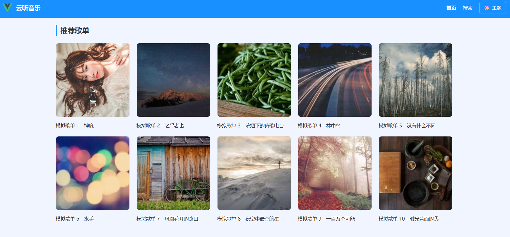
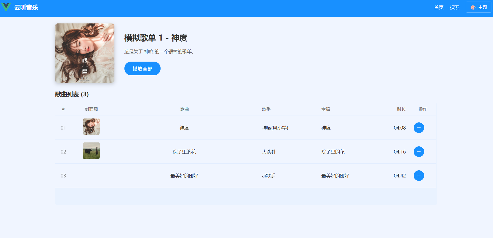
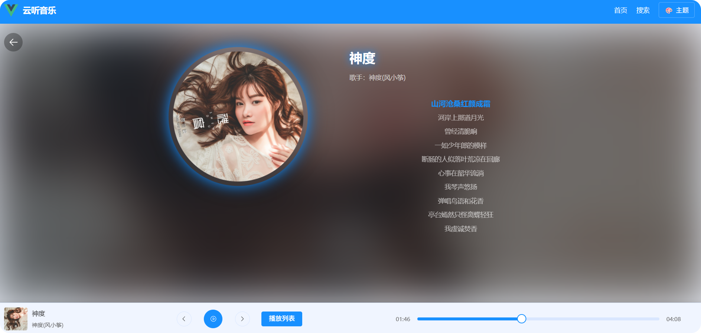

# 仿网易云音乐播放器

## 项目简介
一款基于 Vue 3 + Sass 构建的在线音乐播放器，旨在模仿网易云音乐的核心功能和用户体验。项目支持歌单浏览、歌曲播放、歌词同步滚动以及全局播放控制。

## 主要技术栈
- **前端框架**: Vue 3
- **状态管理**: Pinia
- **路由**: Vue Router (支持懒加载和路由守卫)
- **样式预处理器**: Sass
- **UI 组件库**: Element Plus
- **构建工具**: Vite

## 核心功能
- **首页推荐**: 展示推荐歌单。
- **歌单列表**: 浏览和播放歌单中的歌曲。
- **歌曲播放**: 集成音频播放器，支持播放/暂停、上一曲/下一曲、进度控制。
- **歌词同步滚动**: 播放时歌词自动滚动并高亮当前行。
- **搜索功能**: 快速查找歌曲和歌单。
- **全局播放控制**: 无论在哪个页面，底部播放器都能持续控制音乐播放。
- **主题切换**: 支持切换应用主题。
- **移动端自适应**: 响应式布局，适配不同设备。

## 快速开始

### 环境要求
- Node.js (推荐 v16 或更高版本)
- npm 或 yarn

### 安装与运行
1. 克隆仓库:
   ```bash
   git clone <仓库地址>
   cd yun-music
   ```
2. 安装依赖:
   ```bash
   npm install  # 或者 yarn install
   ```
3. 运行开发服务器:
   ```bash
   npm run dev  # 或者 yarn dev
   ```
   项目将在本地启动，通常在 `http://localhost:5173`。

4. 构建生产版本:
   ```bash
   npm run build # 或者 yarn build
   ```
   构建后的文件将输出到 `dist` 目录。

## 项目结构
```
yun-music/
├── .github/                     # GitHub Actions 配置文件，用于自动化部署
│   └── workflows/
│       └── deploy.yml           # 部署到 GitHub Pages 的工作流
├── public/                      # 静态资源，如音频文件、favicon
│   ├── audio/                   # 示例音频文件
│   └── favicon.svg
├── src/                         # 源代码
│   ├── api/                     # API 服务模块
│   │   ├── playlist.js
│   │   └── song.js
│   ├── assets/                  # 静态资源，如图片、字体等
│   ├── components/              # 可复用组件
│   │   ├── Lyric.vue            # 歌词显示与同步组件
│   │   ├── NavBar.vue           # 顶部导航栏
│   │   ├── Player.vue           # 底部播放器组件
│   │   ├── SongList.vue         # 歌曲列表组件
│   │   └── ThemeSelector.vue    # 主题选择器
│   ├── layouts/                 # 布局组件
│   │   └── AppLayout.vue        # 应用主布局
│   ├── stores/                  # Pinia 状态管理模块
│   │   ├── player.js            # 播放器状态
│   │   └── theme.js             # 主题状态
│   ├── utils/                   # 工具函数
│   │   └── format.js            # 格式化函数
│   ├── views/                   # 页面视图组件
│   │   ├── Home.vue             # 首页
│   │   ├── Playlist.vue         # 歌单详情页
│   │   ├── Search.vue           # 搜索页
│   │   └── SongDetail.vue       # 歌曲详情页
│   ├── App.vue                  # 根组件
│   └── main.js                  # 应用入口文件
├── index.html                   # HTML 模板
├── package.json                 # 项目依赖和脚本
├── vite.config.js               # Vite 配置文件
└── README.md                    # 项目说明
```

## 功能实现细节

### 全局播放控制
- **Pinia 状态管理**: 使用 `player` store ([stores/player.js](file:///e:/简历/面试项目/yun-music/src/stores/player.js)) 集中管理当前播放歌曲、播放列表、播放状态 (播放/暂停)、播放模式、当前播放时间、总时长等。
- **`Player.vue` 组件**: ([components/Player.vue](file:///e:/简历/面试项目/yun-music/src/components/Player.vue)) 负责渲染播放器界面，包括歌曲信息、播放控制按钮（播放/暂停、上一曲、下一曲）、进度条。
- **音频事件监听**: `Player.vue` 中的 `<audio>` 标签监听 `timeupdate` (更新播放时间)、`loadedmetadata` (获取歌曲时长)、`ended` (播放结束) 等事件，并更新 Pinia 状态。

### 歌词同步滚动
- **`Lyric.vue` 组件**: ([components/Lyric.vue](file:///e:/简历/面试项目/yun-music/src/components/Lyric.vue)) 接收 `lyric` 字符串和 `currentTime` 作为 props。
- **歌词解析**: 组件内部通过正则表达式解析歌词字符串，提取每句歌词的时间戳和文本。
- **同步高亮**: `watch` 监听 `currentTime` 变化，计算当前应高亮的歌词行，并通过 CSS `transform` 实现歌词滚动效果。

### 路由管理
- **Vue Router**: ([router/index.js](file:///e:/简历/面试项目/yun-music/src/router/index.js)) 配置了多个路由，包括首页、搜索页、歌单详情页、歌曲详情页。
- **懒加载**: 所有视图组件都采用了路由懒加载 (`component: () => import(...)`)，优化了首次加载性能。
- **路由守卫**: 项目结构支持路由守卫的实现，可用于权限控制或页面跳转逻辑。

### 移动端自适应
- **CSS/Sass**: 样式主要通过 Sass 编写，利用媒体查询实现不同屏幕尺寸下的布局和样式调整。
- **灵活布局**: 采用 `flex` 和 `grid` 布局，确保组件在不同屏幕上都能良好展示。

### GitHub Pages 部署
- **GitHub Actions**: 通过 `.github/workflows/deploy.yml` 配置了 CI/CD 流程。
- **自动化构建与部署**: 当代码推送到 `main` 分支时，自动触发构建 (`npm run build`)，并将构建产物 (`dist` 目录) 部署到 GitHub Pages。

## 代码规范与质量
- 项目结构清晰，文件职责划分明确。
- Vue 组件遵循 `script setup` 语法，代码可读性良好。
- Sass 变量的使用有助于主题管理。
- Pinia 的使用符合最佳实践。

## 截图
请在此处添加项目运行时的截图，例如：

- 
- 
- 
